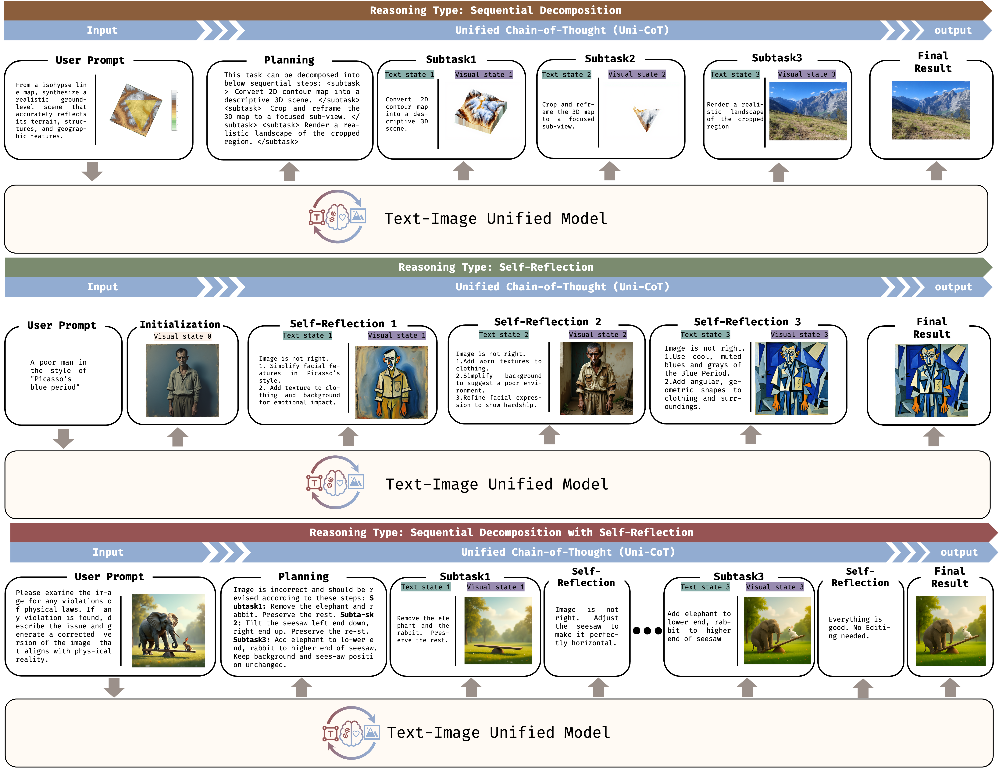
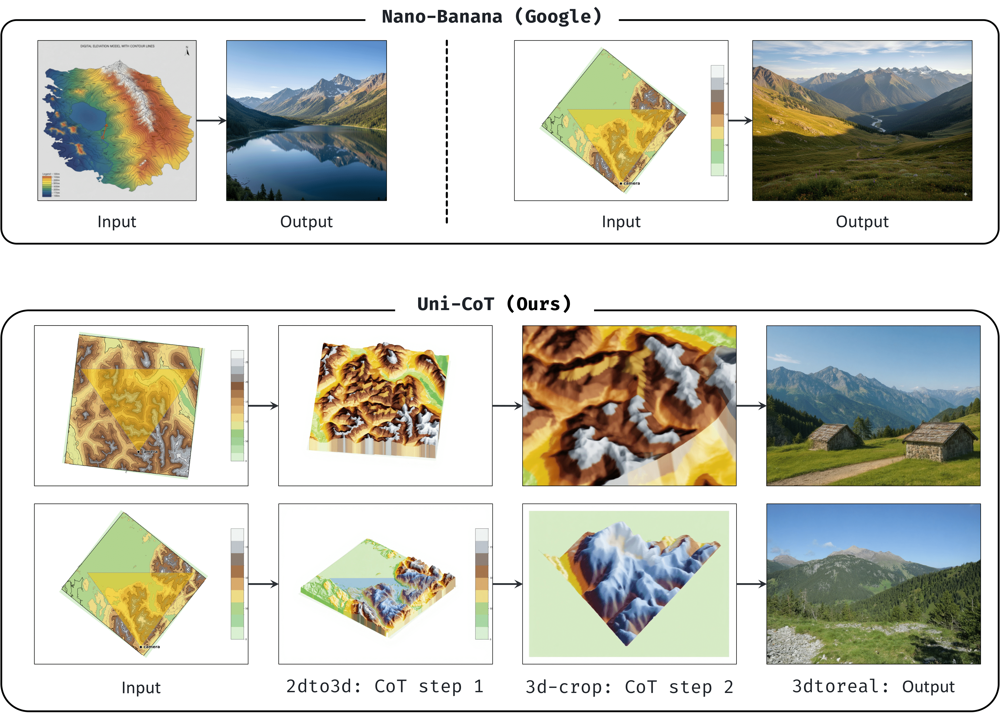
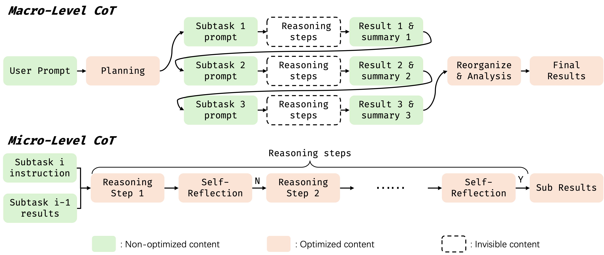
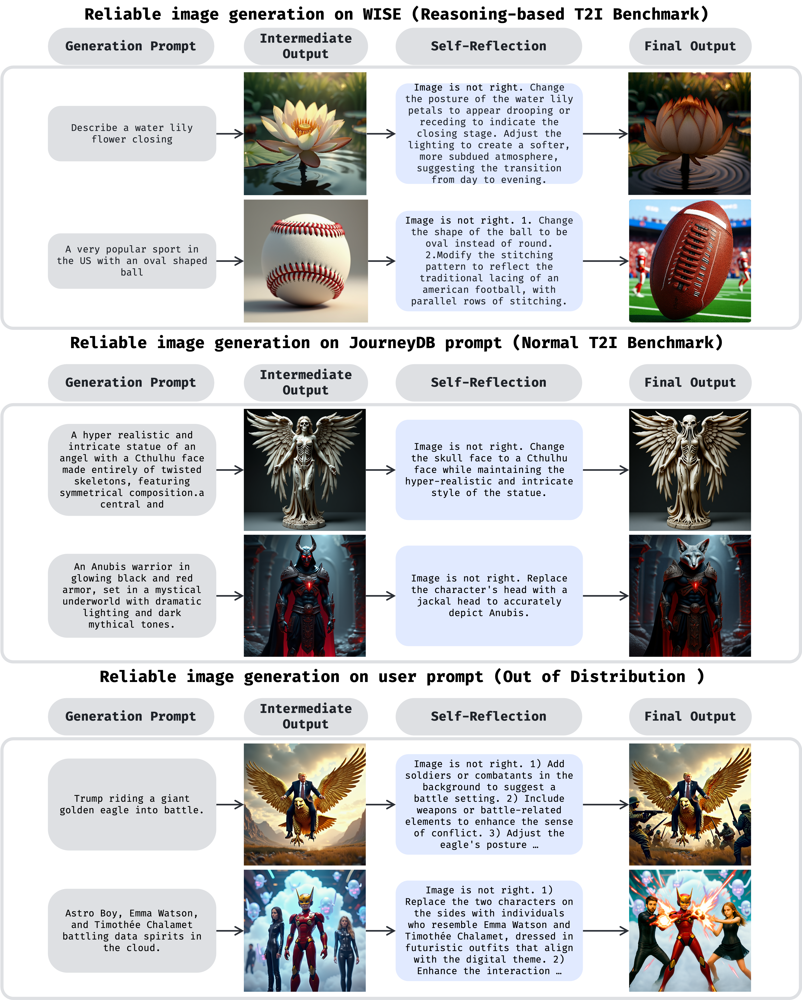
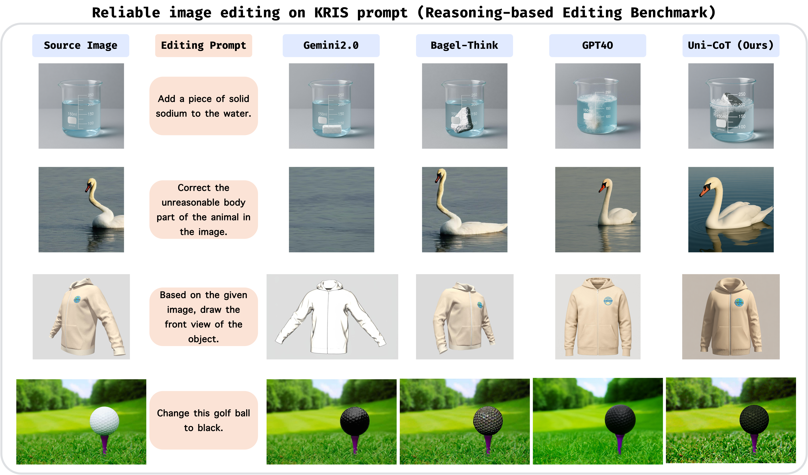

<p align="center">
  
</p>

# Uni-CoT: Towards Unified Chain-of-Thought Reasoning Across Text and Vision

<a href='https://sais-fuxi.github.io/projects/uni-cot/'></a>
<a href='https://arxiv.org/abs/2508.05606v2'></a>
<a href='https://huggingface.co/Fr0zencr4nE/UniCoT-7B-MoT'></a>
<a href='https://huggingface.co/Fr0zencr4nE/UniCoT-7B-MoT-v0.2'></a>

[Luozheng Qin](https://scholar.google.com/citations?user=41BWCzkAAAAJ&hl=zh-CN&oi=ao)<sup>1</sup><sup>\*</sup>,
[Jia Gong](https://scholar.google.com/citations?user=ZV-ThegAAAAJ&hl=zh-CN&oi=ao)<sup>1</sup><sup>\*</sup><sup>#</sup>,
[Yuqing Sun](https://scholar.google.com/citations?hl=zh-CN&user=zR6eHu0AAAAJ)<sup>1</sup><sup>\*</sup>,
[Tianjiao Li](https://scholar.google.com/citations?hl=zh-CN&user=so6xMg8AAAAJ)<sup>3</sup>,
[Haoyu Pan](https://openreview.net/profile?id=~Haoyu_Pan3)<sup>1</sup>,
[Mengping Yang](https://scholar.google.com/citations?user=yF34LtcAAAAJ&hl=zh-CN&oi=ao)<sup>1</sup>,
[Xiaomeng Yang](https://scholar.google.com/citations?hl=zh-CN&user=7evPWQYAAAAJ)<sup>1</sup>,
[Chao Qu](https://scholar.google.com/citations?hl=en&user=DI2NyPsAAAAJ)<sup>4</sup>,
[Zhiyu Tan](https://github.com/SAIS-FUXI)<sup>1,2</sup><sup>+#</sup>,
[Hao Li](https://scholar.google.com/citations?user=pHN-QIwAAAAJ&hl=zh-CN)<sup>1,2</sup><sup>#</sup>,

\* equal contribution + project leader # Corresponding author 

<sup>1</sup>Shanghai Academy of AI for Science, <sup>2</sup>Fudan University, <sup>3</sup>Nanyang Technological University, <sup>4</sup>INFTech

<div>
<a href="mailto:qinluozheng@sais.org.cn">qinluozheng@sais.org.cn</a>&emsp;
<a href="mailto:gongjia@sais.org.cn">gongjia@sais.org.cn</a>&emsp;
<a href="mailto:sunyuqing@sais.org.cn">sunyuqing@sais.org.cn</a>
</div>

## Overview
<p align="center">
  
</p>

---

## Nano-Banana-Style Geography Reasoning Generation
<p align="center">
  
</p>

*Note: UniCoT’s Nano‑Banana–style geography reasoning capability is a work in progress and is not based on the most recently released v0.2 checkpoint. The provided cases are for preview purposes only. We will update the geographic reasoning-related checkpoints and share our insights about implementing them as soon as they are ready.*

## Introduction
While Chain-of-Thought (CoT) reasoning has been proven effective for complex text-based tasks, extending it to multimodal scenarios introduces new challenges. In visual contexts, human reasoning often relies on understanding how visual states evolve over time, such as tracking object movements and spatial interactions. This demands that Multimodal Large Language Models (MLLMs) reason not only at the textual level but also effectively incorporate and interpret visual cues.

To tackle this, we introduce **Uni-CoT**, a unified reasoning framework that extends CoT principles to the **multimodal domain**, empowering Multimodal Large Language Models (MLLMs) to perform **interpretable**, **step-by-step reasoning** across both **text and vision**. The core idea is to decompose complex multimodal tasks into structured, manageable steps that can be executed **sequentially or in parallel**, enabling more scalable and systematic reasoning as shown above.

*Note: We would like to thank the [Bagel team](https://github.com/ByteDance-Seed/Bagel) for integrating strong text and image generation capabilities into a single model, which enables Uni-CoT to be implemented elegantly at current time.*

### 🧠 Reasoning Pipeline
<p align="center">
  
</p>
As illustrated in the figure above, the Uni-CoT framework adopts a two-level hierarchical reasoning architecture:  

1. **Macro-Level CoT**: Decomposes a complex task into simpler subtasks and synthesizes their outcomes to derive the final answer. We design three planning mechanism for different scenarios: *Sequential Decomposition* for causal, step-by-step planning; *Parallel Decomposition* for collaborative, multi-branch planning; *Progressive Refinement* for unknown or highly complex scenarios requiring iterative exploration.  

2. **Micro-Level CoT**: Focuses on executing individual subtasks while filtering out irrelevant information. We incorporate a *Self-Reflection* mechanism to ensure stable and high-quality results in each subtask.

### 🚀 Applications
The Uni-CoT framework aims to solve complex multimodal tasks, including:
* 🎨 Reliable image generation and editing
* 🔍 Visual and physical reasoning
* 🧩 Visual planning
* 📖 Multimodal story understanding

---

## 🔥 News

- ✅ **2025.07.29** &mdash; We released **UniCoT-7B-MoT v0.1** on [Huggingface](https://huggingface.co/Fr0zencr4nE/UniCoT-7B-MoT), which extends Bagel-7B-MoT model to perform text-to-image generation with self-reflection reasoning mechanism.
- ✅ **2025.08.08** &mdash; We released **UniCoT v0.1 technical report** on [Arxiv](https://arxiv.org/abs/2508.05606v1) and [GitHub repository](./docs/arxiv_uni_v0.1.pdf).
- ✅ **2025.09.18** &mdash; We released **UniCoT v0.2 technical report** on [Arxiv](https://arxiv.org/abs/2508.05606) and [GitHub repository](./docs/arxiv_uni_v0.2.pdf). [**UniCoT v0.2**](https://huggingface.co/Fr0zencr4nE/UniCoT-7B-MoT-v0.2) now supports sequential decomposition mechanism such as Nano-Banana–style geography reasoning and complicated image generation.
- ✅ **2025.12.18** &mdash; We released two datasets [Fr0zencr4nE/UniCoT-Self-Reflection-6K](https://huggingface.co/datasets/Fr0zencr4nE/UniCoT-Self-Reflection-6K) and [Fr0zencr4nE/UniCoT-Breakdown-3K](https://huggingface.co/datasets/Fr0zencr4nE/UniCoT-Breakdown-3K) for building two forms of unified interleaved reasoning mechanism implemented in Uni-CoT: self-reflection and breakdown!
- 🎉 **2026.1.27** &mdash; Uni-CoT has been accepted to ICLR 2026!!!
- 🔥 **2026.4.14** We are thrilled to announce [Uni-ViGU](https://github.com/Fr0zenCrane/Uni-ViGU), a new work from our team that achieves unified video understanding and generation within an extended video generator using unified flow matching.
- 🔥 We are still working on this project to implement more kinds of Chain-of-Thought (CoT) mechanisms into a unified model. Please stay tuned!
---

## ✅ To-Do: Uni-CoT Roadmap

A list of planned features and enhancements for the **Uni-CoT** framework:

### 🧠 Reasoning Framework
✅ Release Micro-CoT Reasoning Machnism: self-reflection mechanism.   
✅ Release Macro-CoT Reasoning Machnism: sequential decomposition mechanism.   
[ ] Release Macro-CoT Reasoning Machnism: parallel decomposition mechanism.   
[ ] Release Macro-CoT Reasoning Machnism: progressive refinement mechanism.   


### 🤖 Training Framework
✅ Provide SFT (Supervised Fine-Tuning) framework for multimodal reasoning    
[ ] Provide RL (Reinforcement Learning) framework for multimodal reasoning  

### 📊 Evaluation & Benchmarking
✅ Evaluate Uni-CoT on a reasoning-based text-to-image generation benchmark [WISE](https://github.com/PKU-YuanGroup/WISE)  
✅ Evaluate Uni-CoT on reasoning-based image editing benchmarks: [KRIS Bench](https://github.com/mercurystraw/Kris_Bench) and [RISE Bench](https://github.com/PhoenixZ810/RISEBench)   
[ ] Evaluate Uni-CoT on a reasoning-based understanding benchmark

---


## Quickstart

### Installation

The environment setup of Uni-CoT is consistent with its base model, [Bagel](https://github.com/ByteDance-Seed/Bagel).

```
git clone https://github.com/Fr0zenCrane/UniCoT.git
cd UniCoT
conda create -n unicot python=3.10 -y
conda activate unicot
pip install -r requirements.txt
pip install flash_attn==2.5.8 --no-build-isolation
```

### Model Download

You may directly download the huggingface [checkpoint](https://huggingface.co/Fr0zencr4nE/UniCoT-7B-MoT) or use the following script:

```python
from huggingface_hub import snapshot_download

save_dir = "models/UniCoT-7B-MoT"
repo_id = "Fr0zencr4nE/UniCoT-7B-MoT"
cache_dir = save_dir + "/cache"

snapshot_download(cache_dir=cache_dir,
  local_dir=save_dir,
  repo_id=repo_id,
  local_dir_use_symlinks=False,
  resume_download=True,
  allow_patterns=["*.json", "*.safetensors", "*.bin", "*.py", "*.md", "*.txt"],
)
```


### Self-Reflection Reasoning

To perform evaluation using UniCoT-7B-MoT, you need at least one GPU with 40GB or more VRAM. While lower GPU configurations are acceptable, they are not recommended due to potential performance limitations.

#### Evaluation
To reproduce our results on WISE benchmark, you can use script `./scripts/run_wise_self_reflection.sh`, you may specify your local checkpoint of UniCoT-7B-MoT and output dir using `--model_path` and `outdir`.

```python
gpu_num=8

for i in $(seq 0 $((gpu_num-1)));
do
    CUDA_VISIBLE_DEVICES=$i python inference_mdp_self_reflection_wise.py \
        --group_id $i \
        --group_num $gpu_num \
        --model_path "Fr0zencr4nE/UniCoT-7B-MoT" \
        --data_path "./eval/gen/wise/final_data.json" \
        --outdir "./results" \
        --cfg_text_scale 4 > process_log_$i.log 2>&1 &
done

wait
echo "All background processes finished."
```

#### Inference
For general inference, prepare your prompts by formatting them into a `.txt` file, with one prompt per line, with one prompt per line, you can find a demonstration of this in the repository as `test_prompts.txt`. Once your prompts are ready, use the script `./scripts/run_user_self_reflection.sh` to generate images from your prompts with the added benefit of the self-reflection mechanism.

```python
gpu_num=8

for i in $(seq 0 $((gpu_num-1)));
do
    CUDA_VISIBLE_DEVICES=$i python inference_mdp_self_reflection.py \
        --group_id $i \
        --group_num $gpu_num \
        --model_path "Fr0zencr4nE/UniCoT-7B-MoT" \
        --data_path "./test_prompts.txt" \
        --outdir "./results" \
        --cfg_text_scale 4 > process_log_$i.log 2>&1 &
done

wait
echo "All background processes finished."
```

#### Training
First prepare and format your data, and then start the training by running the following script:

```sh
git clone https://github.com/Fr0zenCrane/UniCoT.git
cd UniCoT
bash ./scripts/train.sh
```
We also provide a LoRA fine-tuning script for users with limited compute, the setup and usage are similar to full fine-tuning:
```sh
git clone https://github.com/Fr0zenCrane/UniCoT.git
cd UniCoT
bash ./scripts/train_lora.sh
```
Important: All reported experimental results were obtained with full fine-tuning. We recommend full fine-tuning for best performance.
For more details related to training, please refer to the training manual of Uni-CoT series' base model: [Bagel](https://github.com/ByteDance-Seed/Bagel/blob/main/TRAIN.md)


## Preliminary Results
### Qualitative Results for Image Generation
<p align="left">
  

### Qualitative Results for Image Editing
<p align="left">
  

### Quantitative Results on WISE  
We first conduct experiments on the [WISE](https://github.com/PKU-YuanGroup/WISE) dataset to evaluate the reasoning capabilities of our method.
As shown in the table below, our model achieves state-of-the-art (SOTA) performance among existing open-source unified models. Our results are averaged over five independent runs to ensure robustness and reliability.
|               | Culture↑ | Time↑   | Space↑  | Biology↑ | Physics↑ | Chemistry↑ | Overall↑ |
|---------------|----------|---------|---------|----------|----------|------------|----------|
| Janus         | 0.16     | 0.26    | 0.35    | 0.28     | 0.30     | 0.14       | 0.23     |
| MetaQuery     | 0.56     | 0.55    | 0.62    | 0.49     | 0.63     | 0.41       | 0.55     |
| Bagel-Think         | 0.76| 0.69 | 0.75 | 0.65 | 0.75 | 0.58   | 0.70     |
| **Uni-CoT**   | **0.76**±0.009 | **0.70**±0.0256 | **0.76**±0.006 | **0.73**±0.021 | **0.81**±0.018 | **0.73**±0.020   | **0.75**±0.013 |
| *GPT4O*       | *0.81*  | *0.71* | *0.89* | *0.83*  | *0.79*  | *0.74*    | *0.80*  |

Furthermore, we apply our self-reflection mechanism to the images generated by the original Bagel model with think mode, aiming to evaluate our method’s ability to calibrate erroneous outputs.
The results in the table below demonstrate that our model effectively refines the imperfect outputs generated by Bagel.

|               | Culture↑ | Time↑   | Space↑  | Biology↑ | Physics↑ | Chemistry↑ | Overall↑ |
|---------------|----------|---------|---------|----------|----------|------------|----------|
| Bagel-Think         | 0.76   | 0.69  | 0.75 | 0.65       | 0.75 | 0.58        | 0.70 |
| Bagel-Think+Uni-CoT | 0.75 | 0.70     | 0.75 | 0.71   | 0.74        | 0.69 | 0.73     |
| **Uni-CoT**   | **0.76**±0.009 | **0.70**±0.0256 | **0.76**±0.006 | **0.73**±0.021 | **0.81**±0.018 | **0.73**±0.020   | **0.75**±0.013 |
| *GPT4O*       | *0.81*     | *0.71*       | *0.89*      | *0.83*     | *0.79*      | *0.74*      | *0.80*       |

### Quantitative Results on [KRIS Bench](https://github.com/mercurystraw/Kris_Bench) 
We also achieve state-of-the-art (SOTA) performance on the KRIS benchmark, even surpassing the closed-source model Gemini2.0.
| Model           | Attribute Perception | Spatial Perception | Temporal Perception | Factual Avg | Social Science | Natural Science | Conceptual Avg | Logical Reasoning | Instruction Decomposition | Procedural Avg | Overall Score |
|----------------|----------------------|---------------------|----------------------|-------------|----------------|------------------|----------------|--------------------|-----------------------------|----------------|----------------|
| Gemini 2.0 (Google)        | 66.33               | 63.33              | 63.92               | 65.26      | 68.19         | 56.94           | 59.65         | 54.13              | 71.67                       | 62.90          | 62.41           |
| Step 3∅ vision (StepFun)   | 69.67               | 61.08              | 63.25               | 66.70      | 66.88         | 60.88           | 62.32         | 49.06              | 54.92                       | 51.99          | 61.43           |
| Doubao (ByteDance)         | 70.92               | 59.17              | 40.58               | 63.30      | 65.50         | 61.19           | 62.23         | 47.75              | 60.58                       | 54.17          | 60.70           |
| BAGEL (ByteDance)          | 64.27               | 62.42              | 42.45               | 60.26      | 55.40         | 56.01           | 55.86         | 52.54              | 50.56                       | 51.69          | 56.21           |
| BAGEL-Think (ByteDance)| 67.42               | 68.33              | 58.67               | 66.18      | 63.55         | 61.40           | 61.92         | 48.12              | 50.22                       | 49.02          |   60.18        |
| **Uni-Cot**       | **72.76**               | **72.87**              | **67.10**               | **71.85**      | **70.81**         | **66.00**           | **67.16**         | **53.43**              | **73.93**                       | **63.68**          |   **68.00**         |
| *GPT-4o* (OpenAI)        | *83.17*               | *79.08*              | *68.25*               | *79.80*      | *85.50*         | *80.06*           | *81.37*         | *71.56*              | *85.08*                       | *78.32*          |   *80.09*         |
---

---
## Citation

```bibtex
@article{qin2025unicot,
  title={Uni-cot: Towards unified chain-of-thought reasoning across text and vision},
  author={Qin, Luozheng and Gong, Jia and Sun, Yuqing and Li, Tianjiao and Yang, Mengping and Yang, Xiaomeng and Qu, Chao and Tan, Zhiyu and Li, Hao},
  journal={arXiv preprint arXiv:2508.05606},
  year={2025}
}

```
---
## Acknowledgement

- [Bagel](https://github.com/ByteDance-Seed/Bagel) proposed by ByteDance-Seed team. Bagel is a powerful and popular unified model for multimodal understanding and generation, making it an ideal foundation and startup for this project. We thank the ByteDance-Seed team for their outstanding work, which has made Uni-CoT possible.
- [WISE](https://github.com/PKU-YuanGroup/WISE) proposed by PKU-YuanGroup. WISE provides a comprehensive benchmark for evaluating text-to-image models on complex semantic understanding and world knowledge integration. By requiring advanced reasoning capabilities, WISE serves as a valuable playground for chain-of-thought (CoT) self-reflection.
- [KRIS-Bench](https://github.com/mercurystraw/Kris_Bench) proposed by Stepfun. KRIS-Bench serves as a comprehensive benchmark for evaluating both instruction-based image editing and knowledge-guided reasoning capabilities for unified models.
- [RISE-Bench](https://github.com/PhoenixZ810/RISEBench) proposed by Shanghai AI Lab. RISE-Bench serves as a comprehensive benchmark for reasoning-informed visual editing. RISEBench focuses on four key reasoning types: Temporal, Causal, Spatial, and Logical Reasoning.

