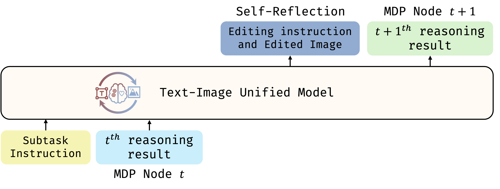
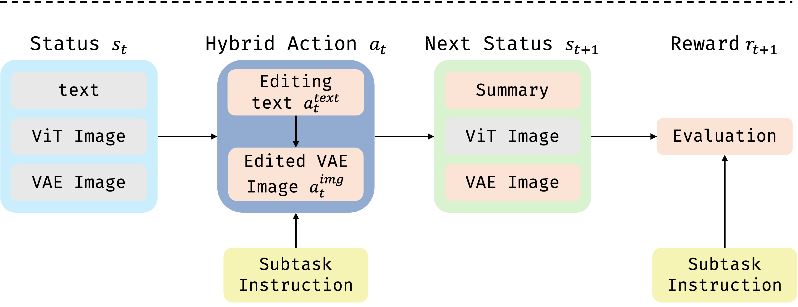

  

# Uni-CoT: Towards Unified Chain-of-Thought Reasoning Across Text and Vision

[Luozheng Qin](https://scholar.google.com/citations?user=41BWCzkAAAAJ&hl=zh-CN&oi=ao)1\*,
[Jia Gong](https://scholar.google.com/citations?user=ZV-ThegAAAAJ&hl=zh-CN&oi=ao)1\*,
[Yuqing Sun](https://github.com/sunyuqingannie)1\*,
[Tianjiao Li](https://scholar.google.com/citations?hl=zh-CN&user=so6xMg8AAAAJ)3,
[Mengping Yang](https://scholar.google.com/citations?user=yF34LtcAAAAJ&hl=zh-CN&oi=ao)1,
[Xiaomeng Yang](https://scholar.google.com/citations?hl=zh-CN&user=7evPWQYAAAAJ)1,
[Chao Qu](https://scholar.google.com/citations?hl=en&user=DI2NyPsAAAAJ)4,
[Zhiyu Tan](https://github.com/SAIS-FUXI)1,2+#,
[Hao Li](https://scholar.google.com/citations?user=pHN-QIwAAAAJ&hl=zh-CN)1,2#,

\* equal contribution + project leader # Corresponding author 

1Shanghai Academy of AI for Science, 2Fudan University, 3Nanyang Technological University, 4INFTech

## Overview
Chain-of-Thought (CoT) reasoning has significantly enhanced LLM performance on complex text tasks by encouraging interpretable, step-by-step problem solving. However, extending this paradigm to multimodal tasks presents new challenges. In vision-language scenarios, human cognition depends on understanding how visual states evolve over time, inferring causality and planning based on object movements, spatial interactions, and transformations, which are critical for physical reasoning, visual planning, and story comprehension.

To bridge this gap, we introduce the Unified Chain-of-Thought (Uni-CoT) framework, designed to empower Multimodal Large Language Models (MLLMs) to perform structured and interpretable reasoning across both text and vision. Uni-CoT first decomposes a given multimodal task into simple, modular steps, and then processes each step either sequentially or in parallel, as illustrated below. Thus, it enables more systematic and scalable reasoning across modalities. 
Specifically, the Uni-CoT reasoning pipeline consists of four key components:
1. **Planning**: Decompose the complex task into a sequence of simpler, manageable subtasks.
2. **Subtask Execution**: Execute each subtask using the unified model with step-by-step reasoning.
3. **Self-Reflection**: After completing each subtask, perform a validation check to ensure the intermediate result aligns with the intended goal.
4. **Final Result**: Aggregate the validated subtask results to generate the final output.

With these designs, our Uni-CoT framework aims to enable unified large models to tackle a wide range of challenging multimodal applications, including:
* Highly reliable image generation/editing
* Visual planning
* Geometric and physical reasoning

  

---

## Methods
### Key Observation
We adapt the unified Bagel-7B-MoT model to perform joint text and image generation in support of UniCoT-style multimodal reasoning. As a first step, we fine-tune the model using its native interleaved text-image training paradigm. While this naïve adaptation enables the model to learn basic UniCoT behaviors, we observe significant challenges when scaling to complex reasoning chains involving multiple image-text steps.        
A primary bottleneck lies in the elevated complexity introduced by visual reasoning. Unlike text-only reasoning, where each step typically consumes 512–1,024 tokens, UniCoT requires generating both a reasoning text and a corresponding image per step. Synthesising Image via VAE-based representation consumes ~4,096 tokens, and encoding the image with a ViT-based representation for understanding incurs an additional ~4,900 tokens, resulting in nearly 9,000 tokens per reasoning step. This substantial overhead significantly increases the computational cost of training and inference. As the reasoning chain grows, the model struggles to converge and generalize, ultimately limiting its performance on complex multimodal tasks.

  

### Our Solution

To mitigate the complexity introduced by long multimodal reasoning chains, we reformulate the Uni-CoT process as a Markov Decision Process (MDP), where each step depends solely on the current state. 
Concretely, we model each reasoning step as a discrete MDP node, which only depends on the preceding step and the task instruction. 
This formulation enables the model to focus on learning local transition dynamics between adjacent nodes, rather than capturing dependencies across the entire reasoning chain as shown below. 
Such a design choice significantly reduces computational overhead and improves training efficiency.

  

Specifically, each MDP node is defined by the following components:

* **State ($s_t$)**: Current context, refer to last reasoning step, including both text and images.
* **Action ($a_t$)**: A hybrid operation that involves generating editing instructions and performing corresponding image edits.
* **Next State ($s_{t+1}$)**: The updated context resulting from the applied action, including the edited image, a textual summary according to the edited image.
* **Reward ($r_{t}$)**: A textual conclusion or scalar score that quantifies the alignment between the outcome and the task objective.

  

Uni-CoT components that requires loss during training are highlighted in pink.

### Training Strategy

With above design, our training focuses on three core objectives:

* Learning to generate **hybrid actions** (text and image edits) that drive reasoning progression.
* Predicting the **next state summary** given the current state and action.
* Estimating **reward** that reflect task completion and reasoning quality.

---

## Experiments

We compare the proposed MDP-based Uni-CoT (Uni-CoT-MDP) against the traditional long-chain Uni-CoT reasoning baseline (Uni-CoT-LC). Both models are trained for 6,000 steps on a dataset of approximately 10,000 samples. Evaluation is conducted on the [WISE](https://github.com/PKU-YuanGroup/WISE) benchmark, which is specifically designed to assess the reasoning capabilities of Multimodal Large Language Models (MLLMs). As shown below, the MDP-based formulation consistently outperforms the long-chain baseline across all metrics, demonstrating its superior learning efficiency and output quality.

It is important to note that below experiments were conducted under constrained resources; therefore, Uni-CoT-MDP should not be considered our final model.

|              | Culture↑ | Time↑   | Space↑  | Biology↑ | Physics↑ | Chemistry↑ | Overall↑ |
|--------------|----------|---------|---------|----------|----------|------------|----------|
| Bagel(base)   | **0.76**    | **0.69**   | <u>0.75</u> | <u>0.65</u> | <u>0.75</u> | 0.58        | <u>0.70</u>   |
| Uni-CoT-LC     | 0.73        | <u>0.67<u> | <u>0.75</u> | 0.60        | <u>0.75</u> | <u>0.65</u> | <u>0.70<u>   |
| **Uni-CoT-MDP**| <u>0.75</u> | 0.66       | **0.78**    | **0.70**    | **0.78**    | **0.71**    | **0.73** |
